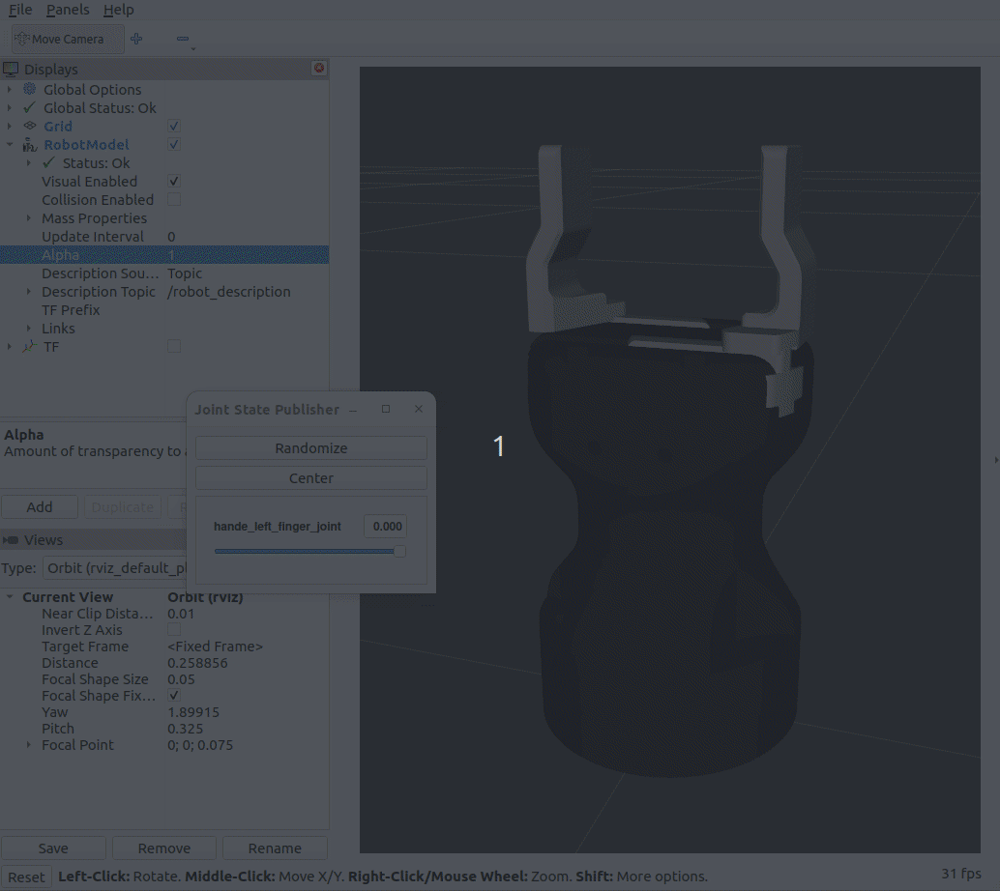

# robotiq_hande_description

This package contains meshes and URDF description of [Robotiq Hand-E gripper](https://robotiq.com/products/hand-e-adaptive-robot-gripper) dedicated for Universal Robots e-series.

- The gripper comes with coupler model (but without flange).
- This repository comes with CAD models imported from STEP files to FreeCAD format (FCStd).
- Package has been developed and tested in ROS 2 Humble.


> [!IMPORTANT]  
> The fingers' joints can be set from **0 to 25 mm** (which correspondes to the maximal grasp with from **0 to 50 mm**).



*(Errata: The minus width range in the animation above is outdated)*

## Usage

In your URDF (Xacro) file include the Hand-E definition. Provide a parent link (for instance `tool0`) as the parameter:

```xml
<xacro:include filename="$(find robotiq_hande_description)/urdf/robotiq_hande_gripper.xacro" />
<!-- ... -->
<xacro:robotiq_hande_gripper parent="PARENT_LINK" prefix="" />
```

An example usage can be find in the [urdf/hande_preview.urdf.xacro](./urdf/robotiq_hande_gripper.urdf.xacro) file.

> [!NOTE]
> The TF frame of the end tip of the gripper is called `${prefix}hande_end`, where `${prefix}` evaluates as the second macro paramater.


## Preview

1. Build the package with `colcon` and source it:
```bash
colcon build --symlink-install
source ./install/setup.bash
```
1. Run the Rviz with a call to the `urdf_launch` package:
```bash
ros2 launch robotiq_hande_description display.launch.py
```

## Credits
- The orignal files of the gripper model were taken from the [Robotiq website](https://robotiq.com/products/hand-e-adaptive-robot-gripper).
- The URDF files are based on work of @cambel [repository](https://github.com/cambel/robotiq.git).
- Preview in Rviz is based on [ROS 2 URDF Tutorial](https://github.com/ros/urdf_tutorial/tree/ros2/).